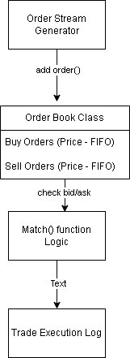
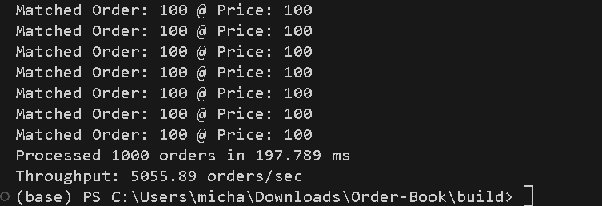
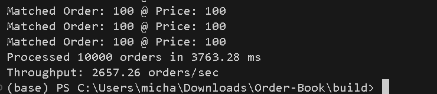
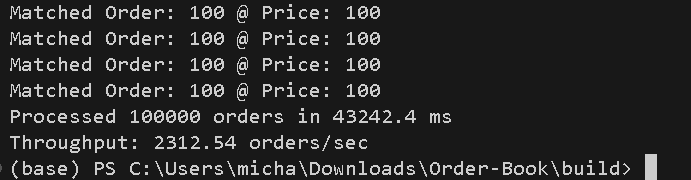

# Order Book Matching Engine (In Progress)

A high-performance, C++-based limit order book and matching engine designed for high-frequency trading (HFT) simulation. The engine targets sub-3µs matching latency and 5M+ msg/sec throughput using cache-aware data structures and lock-free queues.

## 🧩 Features (planned & ongoing)

- [x] FIFO-based price-time priority limit order book (C++ STL baseline)
- [ ] Lock-free message queue between feed handler and matching core
- [ ] Multi-threaded matching engine loop
- [ ] Benchmark suite (latency, throughput, histogram, flamegraph)
- [ ] Kernel-bypass networking with AF_XDP (exploration)
- [ ] Replay historical LOB messages for synthetic load simulation

## 🔧 Technologies

- C++20
- `perf`, `valgrind`, flamegraph profiling
- Lock-free programming (atomic ring buffer)
- Modern CMake + cross-platform Linux

## 🎯 Target Performance

- Matching latency: **< 3µs p99**
- Throughput: **≥ 5 million messages/sec**
- Zero heap allocations in hot path
- Cache-aligned memory layout for limit levels

### 📈 v0.1: Single-Threaded Matching Engine (FIFO Price-Time Book)

The engine maintains a limit order book with price-time priority queues for both buy and sell sides. Orders are matched using simple FIFO logic at overlapping price levels.

Core Components:

C++ STL-based std::map<price, std::queue<Order>> for both buy/sell books

Matching logic compares top-of-book bid/ask and executes trades until price-time conditions are no longer satisfied

Benchmarked at ~5,000 orders/sec on Intel i7-12700K (see below)

## 📈 Benchmark Results (V0.1, 6/29/2025)

| Order Count | Time (ms) | Throughput (orders/sec) |
|-------------|-----------|--------------------------|
| 1,000       | ~198 ms   | ~5,056                   |
| 10,000      | ~3,763 ms | ~2,657                   |
| 100,000     | ~43,242 ms| ~2,312                   |

### 🔍 Throughput Visualization

- 
- 
- 

## 🛠️ Roadmap (v0.2 and beyond)

- [ ] Multi-threaded matching engine with feed handler
- [ ] Lock-free SPSC queue for inter-thread messaging
- [ ] Latency histogram + percentile tracking (p50, p99, p99.9)
- [ ] Linux `perf` + flamegraph profiling
- [ ] Kernel-bypass networking (AF_XDP or DPDK exploration)
- [ ] Market data replay simulation from historical LOB messages
